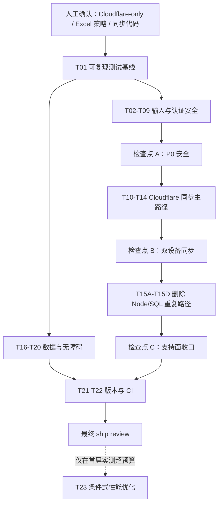

# Implementation Plan: AiPiBox 发布阻断问题修复

**基线：** `main@5367644ce9d1ec0e9e081a09b099fa99e66cf51d`
**日期：** 2026-07-15
**来源：** 2026-07-15 发布前代码、安全、测试专项审查；`specs/security-fix-spec.md` 仅作历史参考，本计划为当前执行基线。
**模式：** 只读规划；实施时按任务逐个完成、验证、评审，不做横向大改。

## 1. 目标

在不增加产品范围的前提下解除当前 NO-GO：封堵可执行内容与本地代理边界，恢复可跨设备使用的云同步，修正认证与数据清理，建立可复现测试和最小 CI，并删除未经验证的重复后端。

项目最终必须满足：

- 不可信聊天、Mermaid、发布页内容不能访问父页面、执行同源脚本或发起未授权网络请求。
- 两个全新浏览器配置使用相同“密码 + 同步代码”时可以上传、下载并合并同一份数据。
- 正确 `AUTH_SECRET` 请求不计入失败限流；错误请求被限制；缺少必需绑定时服务拒绝工作。
- `npm ci`、`npm test`、`npm run build` 在本地和 GitHub Actions 全绿。
- “清除全部数据”、三种图片输入路径、版本显示和无障碍底线与界面承诺一致。

## 2. 实施前决策

以下决策会实质改变范围，开始实施前必须由用户确认：

1. **生产后端：已确认仅保留 Cloudflare Pages Functions + `SYNC_DATA` KV。**
   - 保留：Cloudflare、手动外部 API URL、本地 `proxy/server.js`。
   - 删除：Vercel/Netlify 内置 API、MySQL/PostgreSQL、`api/`、`scripts/init-db.js`。
   - 用户已于 2026-07-15 明确授权删除 Node/Vercel/Netlify/SQL 后端。删除工作可立即执行；它不代表其余发布阻断项已解除。
2. **Excel 解析：推荐暂时禁用。**
   - 默认删除无安全修复 npm 版本的 `xlsx@0.18.5`，并清楚提示不支持 `.xls/.xlsx`。
   - 若必须保留 Excel，需先批准使用 SheetJS 官方 URL tarball，并在 T04 中验证来源、lockfile 和解析回归。
3. **同步身份：采用随机同步代码，不改回固定公共 salt。**
   - 密码负责加密；随机 16-byte salt 作为可复制/导入的同步代码，负责定位命名空间。
   - 这样避免使用相同密码的不同用户落到同一个 KV key。

## 3. 架构决策

- 聊天 Markdown 继续支持经过 `rehype-sanitize` 的基础 HTML，但删除 `iframe/srcDoc` 和自定义 `style` 放行；不新增净化依赖。
- Mermaid 使用 `securityLevel: 'strict'`；显式发布页继续允许脚本演示，但只能在无同源权限、无网络权限的 sandbox 中运行。
- Cloudflare 是唯一正式云后端；本地 Express 代理只绑定 loopback，不承担远程服务职责。
- 云同步沿用随机 salt，但将它升级为用户可备份的同步代码；不会把同步代码写入日志或云端 payload。
- 所有新增测试必须导入生产函数或调用生产 handler；禁止在测试中复制一份 `OLD/NEW` 算法。
- 大 chunk 警告先测量是否影响首屏；不通过提高 warning 阈值或盲目拆包掩盖问题。

## 4. 依赖图

## 5. 全局 Definition of Done

每个任务完成前都必须满足：

- 验收标准全部可观察、可重复。
- 至少有一个最小可运行检查；安全、解析、同步和数据删除必须有自动化测试。
- 测试直接覆盖生产实现，不接受复制算法的测试。
- 只修改任务列出的文件；新增无关重构、依赖或抽象一律退回。
- `git diff --check` 通过，且没有意外生成物或密钥。
- 每个阶段检查点通过并由用户确认后，才能进入下一阶段。

---

## Phase 1：建立可复现基线

### Task T01：恢复可复现安装与测试运行器

**Description：** 补齐 Vitest 已配置但未声明的 `jsdom`，提交 lockfile，并停止忽略它；不顺手升级其他依赖。

**Acceptance criteria：**

- [ ] `package-lock.json` 被跟踪，`.gitignore` 不再忽略它。
- [ ] 全新目录执行 `npm ci` 成功，Vitest 不再因缺少 `jsdom` 在收集测试前退出。
- [ ] 当前断言失败被保留为后续任务输入，不伪造绿色基线。

**Verification：**

- [ ] `npm ci`
- [ ] `npm test -- --reporter=verbose`
- [ ] `npm run build`

**Dependencies：** 人工决策完成。
**Files likely touched：** `.gitignore`、`package.json`、`package-lock.json`。
**Estimated scope：** S，3 文件。

### Checkpoint 1：测试基础设施

- [ ] 安装和测试收集过程可复现。
- [ ] 构建成功。
- [ ] 已知失败均映射到 T02-T20，不存在“原因未知”的失败。

---

## Phase 2：关闭 P0 输入与认证边界

### Task T02：禁止聊天 Markdown 创建可执行 iframe

**Description：** 在现有净化链上删除 `iframe/srcDoc/sandbox` 自定义放行，并删除 `span/div` 的任意 `style` 放行；保留 GFM、KaTeX 和安全基础 HTML。

**Acceptance criteria：**

- [ ] `<iframe srcdoc>`, `<script>`, 事件属性、`javascript:` 和任意内联样式不会进入最终 DOM。
- [ ] GFM、代码块、KaTeX 和普通安全标签仍正常渲染。
- [ ] 回归测试通过真实 `MarkdownRenderer` 渲染，不复制 sanitize schema。

**Verification：**

- [ ] `npm test -- src/__tests__/markdown-security.test.jsx`
- [ ] `npm run build`
- [ ] 浏览器检查恶意用户消息和模型消息的 DOM。

**Dependencies：** T01。
**Files likely touched：** `src/components/chat/MarkdownRenderer.jsx`、`src/__tests__/markdown-security.test.jsx`。
**Estimated scope：** S，2 文件。

### Task T03：隔离 Mermaid 与显式发布页

**Description：** Mermaid 两处初始化统一为严格模式；发布页的所有 `srcDoc` 都由应用包裹固定 CSP，并保持 opaque-origin sandbox。

**Acceptance criteria：**

- [ ] Mermaid 输出不包含脚本、事件属性、`javascript:` 或可执行 `foreignObject`。
- [ ] 发布页没有 `allow-same-origin/top-navigation/forms/popups`，且 `connect-src 'none'`；脚本不能访问父页面或应用存储。
- [ ] 普通流程图、缩放、下载及显式 HTML/CSS/JS 预览仍可用。

**Verification：**

- [ ] `npm test -- src/__tests__/visual-content-security.test.jsx`
- [ ] `npm run build`
- [ ] 浏览器用恶意 Mermaid 和 `srcDoc` payload 检查 DOM、Network、父页面存储。

**Dependencies：** T01。
**Files likely touched：** `src/components/chat/MermaidRenderer.jsx`、`src/components/chat/PublishedPage.jsx`、`src/__tests__/visual-content-security.test.jsx`。
**Estimated scope：** M，3 文件。

### Task T04：修复可触达的文档解析依赖

**Description：** 升级 PDF.js 到已修复版本并使用匹配的本地 worker；默认删除 `xlsx@0.18.5` 和 Excel 入口。若用户批准官方 tarball，则用同一测试保留 Excel。

**Acceptance criteria：**

- [ ] 依赖树不再含 `pdfjs-dist@3.11.174` 或 `xlsx@0.18.5`。
- [ ] PDF 使用本地 worker，所有 `getDocument` 设置 `isEvalSupported: false`，不再回退第三方 CDN。
- [ ] 默认路径对 `.xls/.xlsx` 给出明确不支持错误；合法 PDF 与损坏 PDF 的成功/失败行为有测试。

**Verification：**

- [ ] `npm ls pdfjs-dist xlsx`
- [ ] `npm audit --omit=dev --audit-level=high`
- [ ] `npm test -- src/__tests__/document-parser-security.test.js`
- [ ] `npm run build`

**Dependencies：** T01、Excel 决策。
**Files likely touched：** `package.json`、`package-lock.json`、`src/services/documentParser.js`、`src/components/chat/FileUpload.jsx`、`src/__tests__/document-parser-security.test.js`。
**Estimated scope：** M，5 文件。

### Task T05：让 Cloudflare AI 代理只访问明确目标

**Description：** 将 URL 校验提为同文件可测试的生产函数；只允许 HTTPS、无凭据、许可主机和受控 Azure 资源域名，并禁止自动跟随重定向。

**Acceptance criteria：**

- [ ] HTTP、IP、localhost、用户凭据、非许可域名和恶意重定向在调用 `fetch` 前被拒绝。
- [ ] 许可供应商 HTTPS 请求和 SSE 仍工作。
- [ ] 现有 SSRF 测试删除错误的 `OLD/NEW` 副本，直接调用生产 handler/校验函数。

**Verification：**

- [ ] `npm test -- src/__tests__/ssrf-domain-validation.test.js`
- [ ] `npm run build`

**Dependencies：** T01。
**Files likely touched：** `functions/api/ai-proxy.js`、`src/__tests__/ssrf-domain-validation.test.js`。
**Estimated scope：** S，2 文件。

### Task T06：把本地代理限制为本机开发服务

**Description：** 保留 Ollama/LM Studio 本地开发能力，但仅监听 loopback、限制 CORS、限制本地端口，并在任何路径拼接前验证 `taskId`。

**Acceptance criteria：**

- [ ] 仅监听 `127.0.0.1`；CORS 只允许本地 Vite 源；LAN 客户端无法连接。
- [ ] 远程目标仅允许许可 HTTPS；本地 HTTP 仅允许 `localhost/127.0.0.1` 的 11434/1234；Axios 不自动重定向。
- [ ] `taskId` 必须匹配 `^[A-Za-z0-9_-]{1,128}$`，路径穿越和超长输入不会产生目录外写入。

**Verification：**

- [ ] `npm test -- src/__tests__/local-proxy-security.test.js`
- [ ] `Get-NetTCPConnection -LocalPort 5000`
- [ ] `npm run dev:full` 后验证一次合法非流式、SSE、Ollama/LM Studio 请求。

**Dependencies：** T01。
**Files likely touched：** `proxy/server.js`、可选 `proxy/security.js`、`src/__tests__/local-proxy-security.test.js`。
**Estimated scope：** M，2-3 文件。

### Task T07：删除可逆的多日持久登录

**Description：** 当前 device key 可由公开浏览器信息重建，不能保护存入 localStorage 的主密码。最小修复是删除 1/5/10/30 天选项，仅保留内存会话。

**Acceptance criteria：**

- [ ] 启动时删除旧 `aipibox_auth_persist`，不再把主密码或可恢复密文写入 localStorage。
- [ ] 刷新或重新打开页面后必须重新输入密码；当前标签页内正常会话不受影响。
- [ ] 设置页不再提供持久登录时长。

**Verification：**

- [ ] `npm test -- src/__tests__/auth-persistence.test.js`
- [ ] 浏览器检查 Local Storage，刷新并重新登录。

**Dependencies：** T01。
**Files likely touched：** `src/store/useAuthStore.js`、`src/components/settings/SettingsModal.jsx`、`src/__tests__/auth-persistence.test.js`。
**Estimated scope：** M，3 文件。

### Task T08：把本地密码 verifier 升级为带盐 PBKDF2

**Description：** 用 Web Crypto 生成版本化 verifier；迭代次数编码在值中，并按目标浏览器约 100-250ms 校准。旧 SHA-256 在成功登录后惰性迁移。

**Acceptance criteria：**

- [ ] 格式为版本化的 `pbkdf2-sha256$iterations$salt$digest`，随机 salt 至少 16 bytes。
- [ ] 相同密码生成不同 verifier；正确密码通过、错误密码失败，并使用恒定时间字节比较。
- [ ] 旧 64 位 SHA-256 可成功登录一次并立即升级，不新增旧格式。

**Verification：**

- [ ] `npm test -- src/__tests__/password-verifier.test.js`
- [ ] 用旧 profile 登录、刷新、再次登录验证迁移。

**Dependencies：** T07。
**Files likely touched：** `src/utils/crypto.js`、`src/store/useAuthStore.js`、`src/__tests__/password-verifier.test.js`。
**Estimated scope：** M，3 文件。

### Task T09：收紧主页面 CSP

**Description：** 在 T02-T04 根因修复后移除脚本的 `unsafe-inline/unsafe-eval`；保留现有 UI 所需的最小样式权限和明确的本地开发连接。

**Acceptance criteria：**

- [ ] `script-src` 仅允许 `'self'`；`connect-src` 不再使用 `*`。
- [ ] 生产聊天、PDF、Mermaid、云代理和本地开发代理无 CSP violation。
- [ ] 不通过重新添加宽泛权限解决单个错误。

**Verification：**

- [ ] `npm run build`
- [ ] 浏览器检查 Console/Network，并运行聊天、PDF、Mermaid、Cloudflare 与本地代理 smoke。

**Dependencies：** T02、T03、T04。
**Files likely touched：** `index.html`、可选 `src/__tests__/csp-policy.test.js`。
**Estimated scope：** S，1-2 文件。

### Checkpoint A：P0 安全

- [ ] T02-T09 的安全测试直接覆盖生产实现并全绿。
- [ ] `npm test`、`npm run build`、`npm audit --omit=dev --audit-level=high` 通过。
- [ ] 浏览器和本地代理恶意输入 smoke 完成。
- [ ] 未通过前不得部署。

---

## Phase 3：恢复 Cloudflare 云同步主路径

### Task T10：修复 `syncFromCloud()` 运行时错误

**Description：** 在方法入口读取当前 `cloudSync`，让初始化延迟调用、轮询和手动调用走同一路径；不改冲突合并协议。

**Acceptance criteria：**

- [ ] 未登录、无密码或未启用同步时不发请求。
- [ ] 已登录且启用时可执行 GET，不再出现 `cloudSync is not defined`。
- [ ] `404` 仍表示无云端数据，不进入错误状态。

**Verification：**

- [ ] `npx vitest run src/__tests__/sync-service.test.js --environment node`

**Dependencies：** Checkpoint A。
**Files likely touched：** `src/services/syncService.js`、`src/__tests__/sync-service.test.js`。
**Estimated scope：** S，2 文件。

### Task T11：把随机 salt 定义为可迁移的同步代码

**Description：** 复用现有 `db.settings.syncSalt`，提供严格的导出/导入接口；同步开启后禁止静默切换代码，不进行破坏性服务端迁移。

**Acceptance criteria：**

- [ ] 同密码 + 同 32 位十六进制同步代码生成相同 `syncId`；不同代码生成不同 `syncId`。
- [ ] 既有设备 salt 保持不变且可导出；非法代码不写入 IndexedDB。
- [ ] 同步代码不进入日志、配置同步 payload 或分析事件。

**Verification：**

- [ ] `npx vitest run src/__tests__/sync-identity.test.js --environment node`

**Dependencies：** T10。
**Files likely touched：** `src/services/syncService.js`、`src/__tests__/sync-identity.test.js`。
**Estimated scope：** S，2 文件。

### Task T12：在设置页完成同步代码恢复流程

**Description：** 设置页支持复制当前同步代码、在首次启用前导入同步代码，并说明恢复需要“密码 + 同步代码”。同时收口五种语言的相关文案。

**Acceptance criteria：**

- [ ] 设备 A 可复制代码；设备 B 输入相同密码和代码后得到同一 `syncId`。
- [ ] 同步已启用时不能无警告替换代码；复制和输入控件有可访问名称。
- [ ] 五种语言不再宣称仅凭密码即可恢复。

**Verification：**

- [ ] `npm test -- src/__tests__/sync-settings.test.jsx`
- [ ] 两个独立浏览器 profile 完成导出、导入和首次下载。

**Dependencies：** T11、T07。
**Files likely touched：** `src/components/settings/SettingsModal.jsx`、`src/i18n/translations/*.js`、`src/__tests__/sync-settings.test.jsx`。
**Estimated scope：** M，1 个逻辑组件 + 5 个机械语言文件 + 1 测试。

### Task T13：只对失败的 `AUTH_SECRET` 尝试限流

**Description：** Cloudflare 先做恒定时间比较；正确 secret 直接通过，仅缺失/错误 secret 计入失败限流。正式环境缺少 secret 时 fail closed。

**Acceptance criteria：**

- [ ] 同一 IP 至少 6 个正确请求全部通过，即使该 IP 曾因错误请求受限。
- [ ] 前 5 个错误请求返回 401，第 6 个返回 429；不同 IP 相互独立。
- [ ] 未配置 `AUTH_SECRET` 的受保护请求返回 503，而不是匿名放行。

**Verification：**

- [ ] `npx vitest run src/__tests__/cloudflare-auth.test.js --environment node`

**Dependencies：** T01。
**Files likely touched：** `functions/api/auth.js`、`src/__tests__/cloudflare-auth.test.js`。
**Estimated scope：** S，2 文件。

### Task T14：统一 10 MB 密文契约与健康就绪状态

**Description：** 客户端在加密后测量实际 UTF-8 bytes；Cloudflare 保持最终 10 MB 防线。Health 只检查绑定形状，不产生真实 KV 读取成本。

**Acceptance criteria：**

- [ ] 密文 `<= 10 MB` 可上传，`10 MB + 1 byte` 不调用 Axios，并显示一致错误。
- [ ] 缺少有效 `SYNC_DATA` 或 `AUTH_SECRET` 时 health 返回 503；完整配置返回 200。
- [ ] 模拟 KV 的上传、下载、删除和认证头集成测试通过。

**Verification：**

- [ ] `npx vitest run src/__tests__/sync-size-limit.test.js src/__tests__/cloudflare-health.test.js src/__tests__/cloudflare-sync.test.js --environment node`
- [ ] `npm run build`

**Dependencies：** T10、T11、T13。
**Files likely touched：** `src/services/syncService.js`、`functions/api/health.js`、`functions/api/sync/[[path]].js`、相关测试。
**Estimated scope：** M，3 个生产文件 + 测试。

### Checkpoint B：Cloudflare 主路径

- [ ] 同步、认证、health 专项测试全绿。
- [ ] 两个独立浏览器 profile 完成 A 上传 → B 下载/修改/上传 → A 再下载。
- [ ] 正常连续请求无意外 429；超限 payload 在客户端和服务端均被拒绝。
- [ ] 人工确认 Cloudflare 路径可替代待删除的 Node/SQL 路径。

---

## Phase 4：删除未验证的重复后端

“Cloudflare-only”已获批准。用户明确要求立即执行本工作包；Cloudflare 同步仍需在后续 Checkpoint B 独立验证，删除完成不改变当前 NO-GO 状态。

### Task T15A：收口部署入口与依赖

**Description：** 先停止暴露 Vercel/Netlify/SQL 入口，再删除实现，确保后续删除不会留下可调用的坏脚本。

**Acceptance criteria：**

- [ ] 删除 `deploy:vercel`、`deploy:netlify`、`init-db` 及 `mysql2/pg`。
- [ ] 删除 Vercel/Netlify 配置；环境识别只保留 Cloudflare、本地和外部 API 场景。
- [ ] `express/cors/dotenv/helmet` 保留给本地代理。

**Verification：**

- [ ] `npm ci`
- [ ] `npm run build`
- [ ] `npm run proxy`

**Dependencies：** Checkpoint B、Cloudflare-only 决策。
**Files likely touched：** `package.json`、`package-lock.json`、`vercel.json`、`netlify.toml`、`src/utils/envDetect.js`。
**Estimated scope：** M，5 文件。

### Task T15B：删除 Node 数据库同步实现

**Description：** 删除已无入口的 SQL adapter、初始化脚本和三个 Node sync handler；不改 Cloudflare KV handler。

**Acceptance criteria：**

- [ ] ESM/CJS、schema 字段和 SQL 方言问题随实现删除。
- [ ] 仓库不再包含 DB 配置变量或 `init-db` 调用方。
- [ ] Cloudflare 同步专项测试保持全绿。

**Verification：**

- [ ] `rg -n "DB_TYPE|DB_HOST|mysql2|PostgreSQL|init-db" package.json api scripts src`
- [ ] `npm test -- src/__tests__/cloudflare-sync.test.js`
- [ ] `npm run build`

**Dependencies：** T15A。
**Files likely touched：** `api/sync/*.js`、`api/db-config.js`、`scripts/init-db.js`。
**Estimated scope：** M，5 个删除文件。

### Task T15C：删除其余 Node serverless handler

**Description：** 删除已不受支持的 Node AI proxy、auth 和 health；保留 Cloudflare Functions 与本地代理。

**Acceptance criteria：**

- [ ] `api/` 不再含可部署 handler。
- [ ] AI、同步、health 的正式路径均由 `functions/api/` 提供。
- [ ] 本地 `npm run dev:full` 仍工作。

**Verification：**

- [ ] `rg --files api` 预期无结果。
- [ ] `npm test`
- [ ] `npm run build`

**Dependencies：** T15B。
**Files likely touched：** `api/ai-proxy.js`、`api/auth.js`、`api/health.js`。
**Estimated scope：** S，3 个删除文件。

### Task T15D：更新支持矩阵与部署文档

**Description：** 所有面向用户的 README 和环境示例只描述实际支持的 Cloudflare/本地路径，并同步 Excel、同步代码和 AUTH_SECRET 行为。

**Acceptance criteria：**

- [ ] 不再声称内置 Vercel/Netlify API 或 MySQL/PostgreSQL 同步。
- [ ] 文档说明 `AUTH_SECRET` 与 `SYNC_DATA` 为正式部署必需，恢复需要密码和同步代码。
- [ ] 默认 Excel 禁用路径不再宣称支持 Excel；若批准 tarball，则改为记录实际来源和版本策略。

**Verification：**

- [ ] `rg -n "Vercel/Netlify|MySQL|PostgreSQL|Excel|xlsx" README.md docs .env.example`
- [ ] 人工检查五种语言的部署和安全章节。

**Dependencies：** T04、T12、T15C。
**Files likely touched：** `.env.example`、`README.md`、`docs/README.*.md`。
**Estimated scope：** M，6 个机械文档文件。

### Checkpoint C：支持面收口

- [ ] `rg --files api` 无结果，Cloudflare 与本地代理仍可运行。
- [ ] `npm ci`、`npm test`、`npm run build` 全绿。
- [ ] 文档、环境示例、npm scripts 与实际代码一致。

---

## Phase 5：数据完整性、无障碍与发布门禁

### Task T16：让所有图片入口走同一生产校验

**Description：** 把 magic bytes/SVG 校验移动到 `processImageFiles` 共享入口；选择、粘贴和拖放不再各自决定是否校验。

**Acceptance criteria：**

- [ ] 三种入口都在压缩前拒绝伪造 MIME 和危险 SVG。
- [ ] 合法 PNG/JPEG/GIF/WebP 继续处理。
- [ ] 测试导入生产校验函数，不使用 `slice.arrayBuffer()` 假设或复制算法。

**Verification：**

- [ ] `npm test -- src/__tests__/file-upload-validation.test.js`
- [ ] 浏览器分别选择、粘贴、拖放合法和伪造图片。

**Dependencies：** T01。
**Files likely touched：** `src/components/chat/hooks/useFileHandler.js`、`src/__tests__/file-upload-validation.test.js`。
**Estimated scope：** M，2 文件、3 条输入流。

### Task T17：兑现“清除全部数据”

**Description：** 通过 `db.tables` 清除全部 Dexie 表，并只删除 AiPiBox 自己的 localStorage/sessionStorage 键；不使用 `localStorage.clear()`。

**Acceptance criteria：**

- [ ] `images`、`deleted_records`、`published` 及未来新增的所有表都被清空。
- [ ] `knowledge-base-storage`、`aipibox-ui-storage`、认证和同步版本键被删除。
- [ ] 保留现有“云端删除失败后由用户决定是否只清本地”的流程。

**Verification：**

- [ ] `npm test -- src/__tests__/clear-all-data.test.js`
- [ ] 浏览器准备每类数据，清除并刷新后确认不会恢复。

**Dependencies：** T01、T07。
**Files likely touched：** `src/db/index.js`、`src/components/settings/SettingsModal.jsx`、`src/__tests__/clear-all-data.test.js`。
**Estimated scope：** M，2-3 文件。

### Task T18：修复日志脱敏并测试实际实现

**Description：** 在 `logger.js` 同文件提取纯脱敏函数供生产和测试复用，补齐 JSON `apiKey` 格式；不建立新日志框架。

**Acceptance criteria：**

- [ ] OpenAI、Anthropic、Google、Azure、Bearer、URL 参数和 JSON 属性均脱敏。
- [ ] 普通日志不被误改。
- [ ] 测试删除 `sanitize_OLD/sanitize_NEW` 副本。

**Verification：**

- [ ] `npm test -- src/__tests__/logger-sanitization.test.js`

**Dependencies：** T01。
**Files likely touched：** `src/services/logger.js`、`src/__tests__/logger-sanitization.test.js`。
**Estimated scope：** S，2 文件。

### Task T19：修复登录入口无障碍底线

**Description：** 允许页面缩放，为密码框提供真实标签和错误关联，并让提交状态和错误可被辅助技术感知。

**Acceptance criteria：**

- [ ] viewport 不含 `maximum-scale` 或 `user-scalable=no`。
- [ ] 密码框有 label；错误使用 `aria-describedby` 与 `aria-live`；加载状态有可访问名称。
- [ ] 仅键盘可完成初始化和登录，200% 缩放不丢失操作控件。

**Verification：**

- [ ] `npm run build`
- [ ] 浏览器用 Tab/Enter、200% 缩放和可访问性树检查登录流程。

**Dependencies：** T09。
**Files likely touched：** `index.html`、`src/components/auth/LoginScreen.jsx`、可选静态检查测试。
**Estimated scope：** S，2-3 文件。

### Task T20：补齐核心 Modal 的键盘与焦点行为

**Description：** 为设置、对话设置和图片预览补充 dialog 名称、Escape、初始焦点、焦点约束及关闭后焦点恢复；优先复用现有模式，不新增 UI 依赖。

**Acceptance criteria：**

- [ ] Modal 有 `role="dialog"`、`aria-modal` 和可访问名称。
- [ ] Escape 可关闭，焦点不会逃到背景，关闭后回到触发控件。
- [ ] 图标按钮有可访问名称，键盘可完成主要操作。

**Verification：**

- [ ] `npm run build`
- [ ] 浏览器逐一检查 Settings、ConversationSettings、ImagePreviewModal 的键盘和可访问性树。

**Dependencies：** T12、T17。
**Files likely touched：** `src/components/settings/SettingsModal.jsx`、`src/components/chat/ConversationSettings.jsx`、`src/components/ui/ImagePreviewModal.jsx`、可选测试。
**Estimated scope：** M，3-4 文件。

### Task T21：消除用户可见版本漂移

**Description：** 以 `package.json` 为唯一版本源；Sidebar 和 Cloudflare health 读取同一值，不建立版本管理框架。

**Acceptance criteria：**

- [ ] Sidebar、package、health 显示同一版本。
- [ ] Sidebar 不再硬编码 `v1.1.0`。
- [ ] 构建和 Cloudflare handler 导入版本值成功。

**Verification：**

- [ ] `rg -n "AiPiBox v1\.1\.0|version:\s*'1\.0\.0'" src functions`
- [ ] `npm run build`
- [ ] 调用 `/api/health` 检查版本。

**Dependencies：** T14。
**Files likely touched：** `src/components/layout/Sidebar.jsx`、`functions/api/health.js`。
**Estimated scope：** S，2 文件。

### Task T22：建立最小 GitHub CI 发布门禁

**Description：** 只增加 checkout → Node 20 → `npm ci` → `npm test` → `npm run build`；不加入 coverage、矩阵、自动部署或第三方套件。

**Acceptance criteria：**

- [ ] PR 和 `main` push 都运行同一 workflow，任一步失败即红。
- [ ] GitHub 将该 workflow 配置为合并前 required check。
- [ ] 当前发布候选在本地和 GitHub 使用同一 lockfile 全绿。

**Verification：**

- [ ] 本地依次执行 `npm ci`、`npm test`、`npm run build`。
- [ ] GitHub Actions 对同一 commit 全绿。

**Dependencies：** T01-T21 的必需任务和 Checkpoint C。
**Files likely touched：** `.github/workflows/ci.yml`。
**Estimated scope：** XS，1 文件。

### Checkpoint D：最终发布候选

- [ ] `npm ci`
- [ ] `npm test`
- [ ] `npm run build`
- [ ] `npm audit --omit=dev --audit-level=high`
- [ ] `git diff --check`
- [ ] 两设备同步、认证限流、清除数据、三种图片入口、恶意内容、键盘操作均完成真实浏览器 smoke。
- [ ] 再执行一次 `source-command-ship`；只有新的结论为 GO 才可部署。

---

## Phase 6：条件式性能任务，不阻断本轮修复

### Task T23：只优化实际进入首屏的重资源

**Description：** 先用构建 manifest 和浏览器 Network 判断 PDF/Office/Mermaid chunk 是否首屏加载；只有实测超出预算才改为动态导入。

**Acceptance criteria：**

- [ ] 普通聊天首屏不请求 PDF、Office 或 Mermaid chunk。
- [ ] 相应功能首次使用时才加载资源，解析和渲染无回归。
- [ ] 不通过提高 `chunkSizeWarningLimit` 隐藏问题。

**Verification：**

- [ ] `npm run build -- --manifest`
- [ ] 浏览器分别记录普通首屏、上传 PDF、渲染 Mermaid 的 Network。

**Dependencies：** T03、T04；仅在首屏实测超预算时执行。
**Files likely touched：** `src/components/chat/MermaidRenderer.jsx`、`src/services/documentParser.js`、`vite.config.js`，必要时最多两个调用方。
**Estimated scope：** M，最多 5 文件。

## 6. 并行安排

- T01 完成后，T02、T03、T05、T06、T07、T16、T18 可并行；T04 会改 lockfile，应单独合并。
- T07 → T08 顺序执行；T02/T03/T04 → T09 顺序执行。
- Checkpoint A 后，T10 与 T13 可并行；T10 → T11 → T12，T10/T11/T13 → T14。
- T15A → T15B → T15C → T15D 必须串行，且只能在 Checkpoint B 后执行。
- T16-T20 可分工，但 `SettingsModal.jsx` 由 T07、T12、T17、T20 依次修改，不能并行写同一文件。
- T22 永远最后执行。

## 7. 回滚边界

- 每个任务单独提交；检查点前不做 squash，便于逐任务回退。
- T11/T12 不删除旧云端 key；先证明新设备可恢复，再另行决定清理策略。
- T15A-T15D 只有在 Cloudflare 双设备流程通过后执行；若发现现网 Node 用户，整体回退该工作包。
- T04 默认禁用 Excel是可逆降级；只有批准可信分发源和回归测试后才恢复。
- 任一数据删除、同步或认证回归立即停止后续任务，不用后续补丁掩盖前一任务失败。

## 8. Open Questions

1. Excel 是必须保留的发布功能，还是接受本轮暂时禁用？
2. 是否接受新设备恢复需要“主密码 + 同步代码”，并要求用户自行安全备份同步代码？
